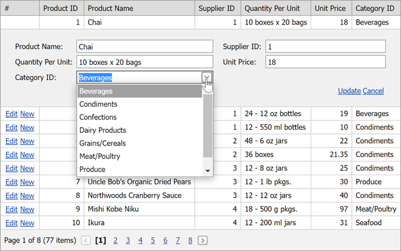

<!-- default badges list -->

[](https://supportcenter.devexpress.com/ticket/details/E3591)
[](https://docs.devexpress.com/GeneralInformation/403183)
[](#does-this-example-address-your-development-requirementsobjectives)
<!-- default badges end -->

# Grid View for ASP.NET Web Forms - How to bind the GridViewDataComboBoxColumn edit form editor at runtime


This example illustrates how to populate a [GridViewDataComboBoxColumn](https://docs.devexpress.com/AspNet/DevExpress.Web.GridViewDataComboBoxColumn?p=netframework) with data and set its properties at runtime.



Use the [GridViewDataComboBoxColumn.PropertiesComboBox](https://docs.devexpress.com/AspNet/DevExpress.Web.GridViewDataComboBoxColumn.PropertiesComboBox) property to access and customize column editor settings:

```cs
protected void Page_Load(object sender, EventArgs e) {
    var comboColumn = ((GridViewDataComboBoxColumn)grid.Columns["CategoryID"]);
    comboColumn.PropertiesComboBox.DataSource = dsCombo;
    comboColumn.PropertiesComboBox.TextField = "CategoryName";
    comboColumn.PropertiesComboBox.ValueField = "CategoryID";
    comboColumn.PropertiesComboBox.ValueType = typeof(Int32);
}
```

**Note:** The [ComboBoxProperties.ValueType](https://docs.devexpress.com/AspNet/DevExpress.Web.ComboBoxProperties.ValueType) should be set according to the [Data Type Mappings (ADO.NET)](https://docs.microsoft.com/en-us/dotnet/framework/data/adonet/sql-server-data-type-mappings) table.


## Files to Look At

* [Default.aspx](./CS/WebSite/Default.aspx) (VB: [Default.aspx](./VB/WebSite/Default.aspx))
* [Default.aspx.cs](./CS/WebSite/Default.aspx.cs) (VB: [Default.aspx.vb](./VB/WebSite/Default.aspx.vb))

## Documentation

* [ASPxGridView](https://docs.devexpress.com/AspNet/DevExpress.Web.ASPxGridView)
* [Grid View - Edit Data](https://docs.devexpress.com/AspNet/3712/components/grid-view/concepts/edit-data)
* [Grid View - Examples](https://docs.devexpress.com/AspNet/3768/components/grid-view/examples)

## More Examples

* [ASPxGridView - How to bind GridViewDataComboBoxColumn Edit Form editor at runtime](https://github.com/DevExpress-Examples/aspxgridview-batch-edit-how-to-calculate-values-on-the-fly-t114539)
* [How to edit data in a DataTable using ASPxGridView at runtime when data is stored in ViewState](https://github.com/DevExpress-Examples/how-to-edit-data-in-a-datatable-using-aspxgridview-at-runtime-when-data-is-stored-in-viewsta-e2945)
* [ASPxGridView - Batch Edit mode - How to remove already selected ComboBox column items](https://github.com/DevExpress-Examples/aspxgridview-batch-edit-mode-how-to-remove-already-selected-combobox-column-items-t449262)
<!-- feedback -->
## Does this example address your development requirements/objectives?

[](https://www.devexpress.com/support/examples/survey.xml?utm_source=github&utm_campaign=asp-net-web-forms-grid-bind-comboboxcolumn-edit-form-editor-at-runtime&~~~was_helpful=yes) [](https://www.devexpress.com/support/examples/survey.xml?utm_source=github&utm_campaign=asp-net-web-forms-grid-bind-comboboxcolumn-edit-form-editor-at-runtime&~~~was_helpful=no)

(you will be redirected to DevExpress.com to submit your response)
<!-- feedback end -->
